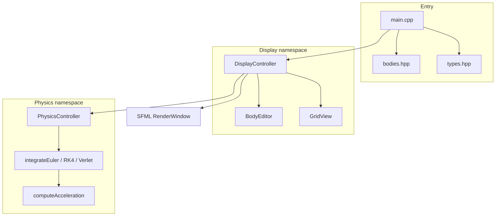
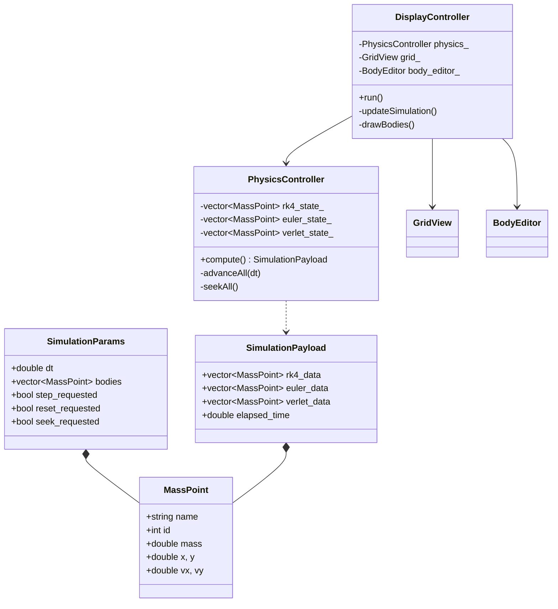
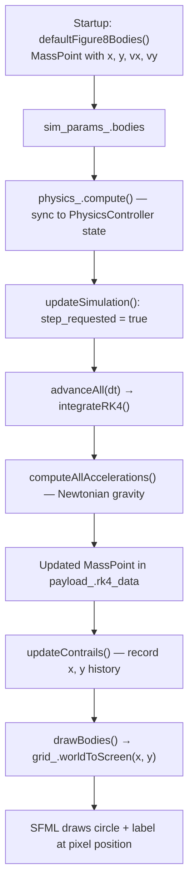
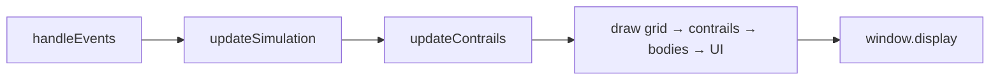
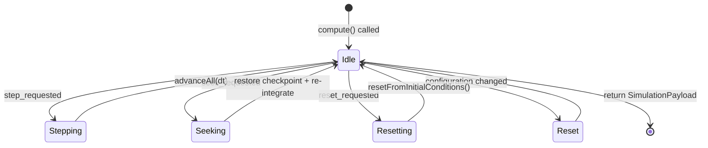
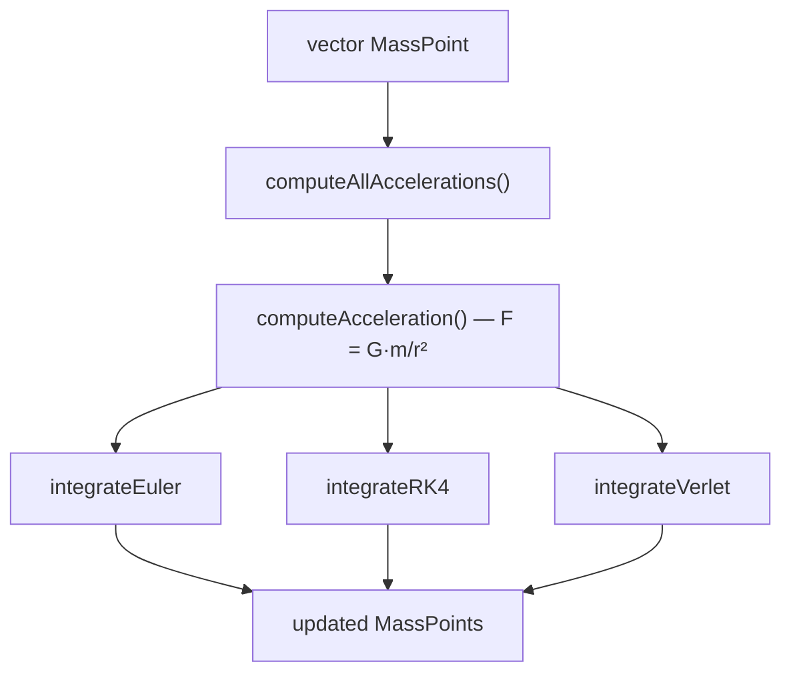

# 3-Body Problem Simulation

A 2D three-body simulator with Euler and RK4 integrators, built with C++17, CMake, and SFML.

## Prerequisites

Install these once on your machine (they are **not** part of the repo):

| Tool | Notes |
|------|--------|
| **Git** | Required on first build — CMake downloads SFML automatically |
| **CMake** 3.16+ | [cmake.org](https://cmake.org/download/) |
| **C++17 compiler** | MinGW-w64 / g++ on Windows, or MSVC / Clang elsewhere |
| **Internet** | First configure step fetches SFML 2.6.2 from GitHub |

You do **not** need to install SFML separately.

## After `git pull`

You only need the source tree (`*.cpp`, `*.hpp`, `CMakeLists.txt`, etc.). Generated folders such as `build/` and `dist/` are created locally and are not required in the repo.

From the project root:

```powershell
mkdir build
cd build
cmake .. -G "MinGW Makefiles" -DCMAKE_BUILD_TYPE=Release -DCMAKE_CXX_COMPILER="C:/MinGW/bin/g++.exe"
cmake --build .
```

Adjust the compiler path if your g++ lives elsewhere. On Linux/macOS, omit `-G` and `-DCMAKE_CXX_COMPILER` and use your default toolchain:

```bash
mkdir build && cd build
cmake .. -DCMAKE_BUILD_TYPE=Release
cmake --build .
```

The first build takes a few minutes while SFML is downloaded and compiled.

## Running

On Windows, the executable needs the SFML DLLs in the **same folder** as `NBodyProblem.exe`. The CMake post-build step copies them automatically.

**Option 1 — run from `build/`**

```powershell
cd build
.\NBodyProblem.exe
```

**Option 2 — run from `dist/`** (also populated automatically after each build)

```powershell
.\dist\NBodyProblem.exe
```

Do not copy `NBodyProblem.exe` alone to another folder without the three DLLs beside it:

- `sfml-graphics-2.dll`
- `sfml-window-2.dll`
- `sfml-system-2.dll`

## Rebuilding after changes

```powershell
cd build
cmake --build .
```

Only re-run `cmake ..` if you changed `CMakeLists.txt` or switched compilers.

## Project layout

```
main.cpp
types.hpp
CMakeLists.txt
physics/
  calculate.cpp
  definitions/calculate.hpp
display/
  display.cpp
  grid.cpp
  definitions/display.hpp
  definitions/grid.hpp
```

## Controls

- **Play / Pause / Reset / Seek** — playback and time scrubbing
- **Compare** — run Euler and RK4 side by side
- **RK4 / Euler** — single-integrator mode
- **1 yr / 1 mo / 1 wk** — timestep (in years)

Units: masses in solar masses, positions in AU, velocities in km/s, time in years.

---

## Architecture (addendum)

This section describes what the simulator does and how code is organized, beyond build and run instructions.

### What it does

The app simulates three gravitationally interacting bodies in 2D. You can edit initial conditions, pick a timestep, and watch trajectories evolve under Newtonian gravity. Three numerical integrators — **Euler**, **RK4**, and **Verlet** — can run individually or side-by-side in **Compare** mode so you can see how integration error diverges over time.

Initial presets (Figure-8, Lagrange triangle, Euler collinear) live in `bodies.hpp`. The physics engine keeps separate state per integrator, saves checkpoints every ~15 simulated years for fast seeking, and returns the latest positions to the display layer each frame.

### Module structure

The project splits into two layers connected by shared structs in `types.hpp`:



| Layer | Role |
|-------|------|
| `main.cpp` | Builds initial `SimulationParams` and starts the UI loop |
| `types.hpp` | Shared data contracts (`MassPoint`, `SimulationParams`, `SimulationPayload`, …) |
| `bodies.hpp` | Initial-condition presets |
| `DisplayController` | Event loop, rendering, playback controls |
| `PhysicsController` | State, checkpoints, stepping, seeking |
| `GridView` | World coordinates (AU) → screen pixels |

The display layer never integrates physics itself. It sets request flags, calls `PhysicsController::compute()`, and renders the returned `SimulationPayload`.

### Class relationships



### Data flow: one body from initial state to drawn position

Tracing a single mass point (e.g. `m1`) through one **Play** frame:



| Step | Location | What happens |
|------|----------|--------------|
| 1 | `bodies.hpp` | Preset defines `(x, y, vx, vy)` in physical units |
| 2 | `DisplayController` | Bodies stored in `SimulationParams`; editable via `BodyEditor` |
| 3 | `PhysicsController::compute()` | Copies into `initial_conditions_` and per-integrator state vectors |
| 4 | `updateSimulation()` | Sets `step_requested`; calls `compute()` each frame while playing |
| 5 | `advanceAll()` | Each active integrator steps forward by `dt` |
| 6 | `computeAcceleration()` | Sums gravitational pulls from all other bodies (softened at small distances) |
| 7 | `integrateRK4` / `Euler` / `Verlet` | Produces new `(x, y, vx, vy)` |
| 8 | `SimulationPayload` | Latest world positions returned to display |
| 9 | `updateContrails()` | Appends `(x, y)` to a deque (last 45 points per body/integrator) |
| 10 | `GridView::worldToScreen()` | Converts AU → pixels (`y` flipped for screen coords) |
| 11 | `drawBodies()` | Renders colored circles (red = RK4, white = Euler, green = Verlet) |

### Frame loop

Each frame while the window is open:



Physics runs **before** drawing, so the screen always reflects the state returned by the latest `compute()` call.

### Physics controller dispatch

`PhysicsController::compute()` is the single entry point for all simulation changes:



| Request flag | Effect |
|--------------|--------|
| `step_requested` | Advance one timestep via `advanceAll(dt)` |
| `reset_requested` | Restore initial conditions; clear checkpoints |
| `seek_requested` | Jump to target time using saved checkpoints (~every 15 yr) |

### Integrators

All three integrators share the same force model; only the time-stepping method differs:



In **Compare** mode, all three run on separate copies of state (`rk4_state_`, `euler_state_`, `verlet_state_`), so the same body may appear as three slightly offset circles — illustrating integrator drift.
